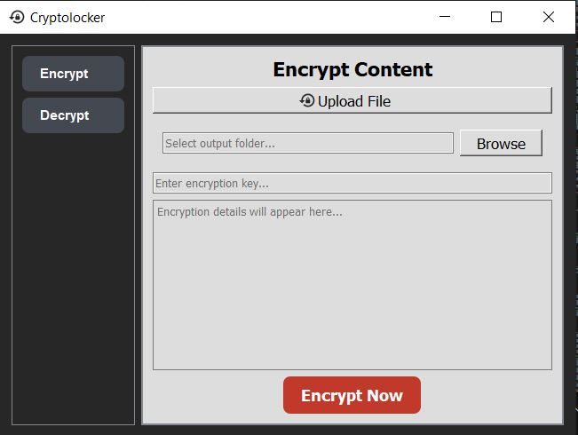
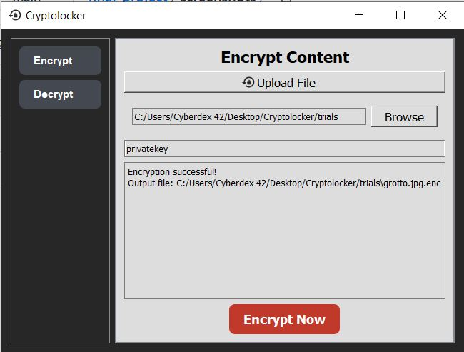
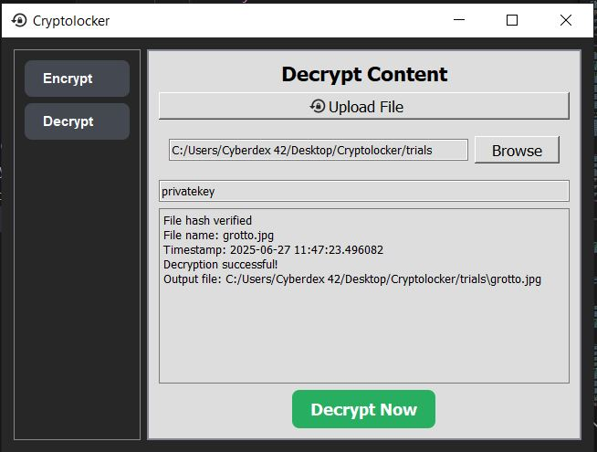
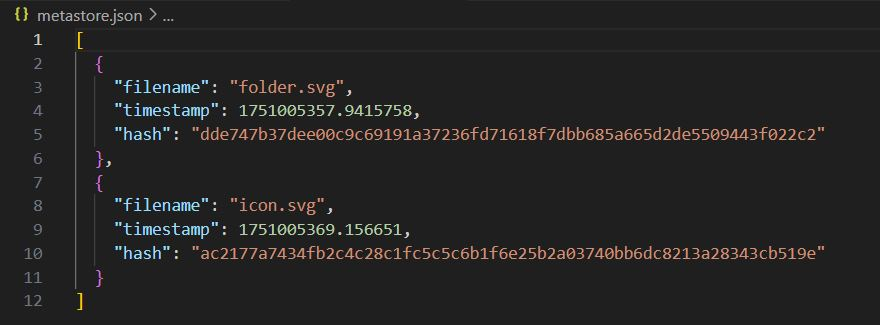

# Cryptolocker
An AES based GUI application for file encryption and integrity verification

## Secure File Storage System with AES-256

A simple and secure local file storage application using **AES-256 encryption**, built with **Python**, **PyQt5**, and the **cryptography** library. The app allows users to encrypt/decrypt files, store them securely, and verify their integrity using SHA-256 hashing.

---

## Features

- AES-256 encryption and decryption (CBC mode)
- Manual key and IV entry
- File upload and secure storage with `.enc` extension
- Secure metadata storage (filename, timestamp, SHA-256 hash)
- File integrity verification before decryption
- Easy-to-use GUI built with PyQt5

---

## Screenshots

### Home Interface
> _Main interface with options to upload, encrypt and decrypt data._



---

### File Upload and Encryption
> _File selection and encryption screen with key input._



---

### Decryption and Integrity Verification
> _Decryption module that checks for file tampering using hash verification._



---

### Metadata View
> _Displays stored metadata such as filename, encryption date/time, and hash._



---

## Tools & Technologies

- **Python 3.x**
- **PyQt5** – GUI development
- **cryptography** – AES encryption/decryption
- **hashlib** – SHA-256 hash generation
- **os / json / datetime** – Metadata management and file handling

---

## How to Run

1. **Install Requirements**

```bash
pip install -r requirements.txt

2. **Run the main script**

```bash
python main.py

